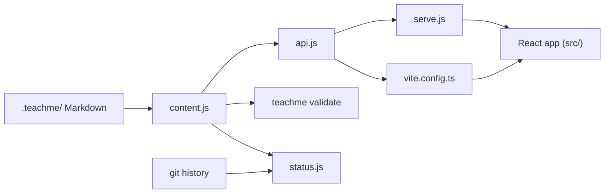

TeachMe has two halves that never share a process at runtime: a small Node server that
reads Markdown from disk, and a React app in the browser that renders it. Knowing where the
line between them sits tells you where to look for any bug: "the TOC is wrong" is a server
problem, "the diagram doesn't render" is a browser problem.

## One CLI, three commands

`package.json` maps the `teachme` command to `bin/teachme.js`:

```json
"bin": {
  "teachme": "bin/teachme.js"
},
```

That script dispatches on its first positional argument (`bin/teachme.js` → `main()`):

```js
const [first, second] = positionals;
if (first === "validate") {
  runValidate(second);
  return;
}
if (first === "status") {
  runStatus(second, { json: !!values.json });
  return;
}

await runServe(first, { port, open: !noOpen });
```

All three commands start the same way: they call `loadContent()` from `server/content.js`,
which reads the whole `.teachme/` folder into one `Content` object with `errors` and
`warnings`. `validate` prints those issues, `status` compares the content with git history
(`server/status.js`), and the default command starts an HTTP server (`server/serve.js`).

## How the pieces connect

The diagram shows the path from files on disk to the browser. `loadContent()` in
`server/content.js` reads the files, and `createHandler()` in `server/api.js` turns them into
API responses. That handler is used in two places: by `startServer()` in `server/serve.js`
in production, and by the `teachmeDevMiddleware()` Vite plugin in `vite.config.ts` during
development. `buildStatus()` in `server/status.js` combines the loaded content with the
git history.



The browser side talks to the server only through the fetch helpers in `src/api.ts`
(`getCatalog`, `getCourse`, `getPage`, `getQuiz`, `getProgress`, `putProgress`). The
response shapes are declared once in `shared/types.d.ts` and imported by both sides.

## Key takeaways

- `bin/teachme.js` dispatches to `validate`, `status`, or serve; all three start from
  `loadContent()`.
- The server sends raw Markdown as JSON; rendering happens in the browser.
- `createHandler()` is shared by the production server and the Vite dev server.
