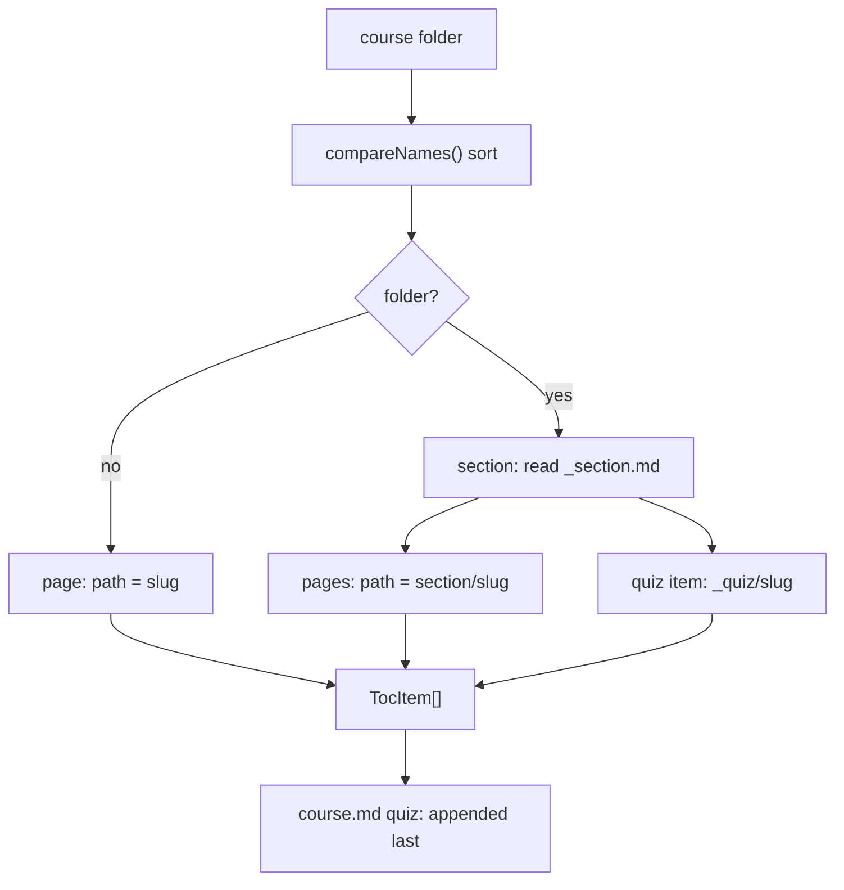

Authors never write a table of contents. They name files and folders, and TeachMe derives
the order, the slugs, and the TOC from those names. If a page shows up in the wrong place or
under the wrong URL, the cause is almost always a file name.

## Names become order and slugs

`server/content.js` strips a leading numeric prefix to get a slug:

```js
const PREFIX_RE = /^(\d+)-(.+)$/;
…
function stripPrefix(name) {
  const m = PREFIX_RE.exec(name);
  return m ? m[2] : name;
}
```

`fileSlug()` also drops `.md`, so `02-first-request.md` becomes `first-request`. Course and
quiz folders are not stripped: `loadCourses()` passes `entry.name` as the slug unchanged.

Sorting uses `compareNames()`: names with a numeric prefix come first, ordered by the
number's value (so `10-` sorts after `9-`), then unprefixed names alphabetically.

## Walking a course

`loadCourseToc()` lists the course folder, skips `course.md` and anything starting with `_`,
and sorts the rest. A file becomes a top-level page; a folder becomes a section. Inside a
section only files are read, so nested folders are ignored. The flow for one course:



Every entry becomes a `TocItem` from `shared/types.d.ts`:

```ts
export type TocItem = {
  type: "page" | "quiz";
  path: string;
  title: string;
  section: string | null;
  quizSlug?: string;
};
```

Quiz items get the path `_quiz/<slug>`: a section's quiz is pushed after that section's
pages, and the course's own `quiz:` is pushed after everything, with `section: null`.

Slugs must be unique per scope. `loadCourseToc()` keeps a `topSlugs` set for top-level pages
and sections, and a `sectionSlugs` set per section; a clash records
`` `Duplicate slug "${pageSlug}"` `` and skips the second entry.

## Key takeaways

- Order comes from `NN-` prefixes (numeric value), slugs are names without prefix and `.md`.
- One level of sections: a folder in a course is a section, a folder in a section is ignored.
- Quizzes appear in the TOC as `_quiz/<slug>` items, after their section or at the very end.
