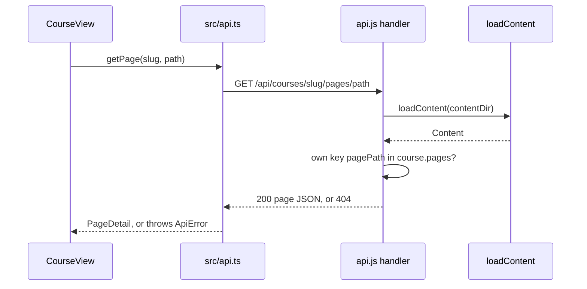

The server's whole job is to answer a handful of JSON routes and serve images, without ever
reading a file outside the content folder. Content is re-read from disk on every request, so
an agent can regenerate lessons while the app is open and a reload shows the new version.

## Routes

`createHandler()` in `server/api.js` returns one `(req, res, next)` function. It matches:

| Route | Handler |
|---|---|
| `GET /api/catalog` | inline: course and quiz summaries plus errors and warnings |
| `GET /api/courses/:slug` | `handleGetCourse()` → `toCourseDetail()` |
| `GET /api/courses/:slug/pages/*` | `handleGetPage()` |
| `GET /api/quizzes/:slug` | `handleGetQuiz()` → `toQuizDetail()` |
| `GET`/`PUT /api/progress` | progress store (next lesson) |
| `GET /content/*` | `handleGetContentFile()` |

Any other `/api/` path gets a 404 JSON body `{ error: "Not found" }`; any other path is
passed to `next()`. The content routes (catalog, course, page and quiz) each call
`loadContent()` on every request: there is no cache. The progress and `/content/*` routes
do not load content at all.

The sequence for opening a lesson:



## Why page paths are safe

A page request never touches the file system with the requested path. `handleGetPage()`
looks the decoded path up as a key in `course.pages`, a map the loader built from the real
folder, and only accepts the map's own keys:

```js
const page = course && Object.hasOwn(course.pages, pagePath) ? course.pages[pagePath] : undefined;
```

An unknown key is a 404, including names inherited from `Object.prototype` such as
`constructor` or `__proto__`.

`/content/*` does read files by path, so it checks twice. First textually, then after
resolving symlinks (`handleGetContentFile()`):

```js
const resolved = path.resolve(contentDir, decoded);
if (!resolved.startsWith(contentDir + path.sep)) {
  sendNotFound(res);
  return;
}
…
if (!real.startsWith(contentDirReal + path.sep)) {
  sendNotFound(res);
  return;
}
```

`real` comes from `fs.realpathSync(resolved)`, so a symlink inside `.teachme/` that points
elsewhere is rejected too.

## The production server

`startServer()` in `server/serve.js` wraps this handler in a `node:http` server and passes
a static-file handler for `dist/` as `next`. Unknown paths fall back to `dist/index.html`
so the React router can handle deep links such as `/courses/x/y`. It binds to
`HOST = "127.0.0.1"` only, starting at port 4321 and trying up to `MAX_PORT_ATTEMPTS` (20)
ports on `EADDRINUSE`.

## Key takeaways

- Every content request (catalog, course, page, quiz) reloads content from disk.
- Page paths are own-key map lookups; only `/content/*` reads files by path, with two containment
  checks.
- The server listens on `127.0.0.1` and falls back to `index.html` for client routes.
