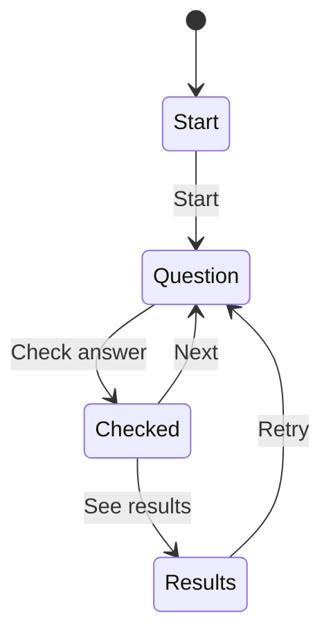

Quizzes run in two places, standalone at `/quizzes/:slug` and inline in a course, but the
learner should get the same experience and the same saved history in both. One component,
`QuizRunner`, handles both; only its `context` and `onContinue` props differ.

## Phases

`QuizRunner` in `src/components/QuizRunner.tsx` keeps a `phase` of `"start"`,
`"question"` or `"results"`, plus a `checked` flag while on a question:



**Check answer** is disabled until something is selected. Once checked, the inputs are
disabled, options are marked correct or incorrect, and the explanation appears. Nothing
prevents moving on after a wrong answer.

A question renders checkboxes and the hint "Select all that apply" when `question.multi`
is true, radio buttons otherwise.

## Scoring and saving

When the last question is answered, `finish()` scores every question with `isCorrect()`
from `src/progress.ts`, which compares the selected indices with the correct ones as sets:

```ts
const correctIndices = new Set(correct.flatMap((c, i) => (c ? [i] : [])));
const selectedIndices = new Set(selected);
if (correctIndices.size !== selectedIndices.size) return false;
```

There is no partial credit: a multi-select question with one of two right options counts as
wrong. `finish()` then saves exactly one attempt:

```tsx
const attempt: Attempt = { context, date: new Date().toISOString(), score, total, answers };
update((p) => addAttempt(p, quiz.slug, attempt));
```

`context` is `"standalone"` from `QuizView`, or `course:<slug>` from the course view.
**Retry** resets the answers and goes straight to question 1, skipping the start screen.

## Results

`QuizResults` shows the score, "Passed" or "Not passed" against `passingScore`, and an
expandable ✓/✗ row per question with the learner's answer, the correct answer and the
explanation. Its buttons depend on context: in a course, **Continue** calls `onContinue`
(the next TOC item); standalone, **Back to home** plus a link to the quiz's related
`course`, if it has one.

## Key takeaways

- One `QuizRunner` serves standalone and inline quizzes; `context` tells them apart.
- Scoring is all-or-nothing per question, by set equality.
- One attempt is saved per run, when results are reached; failing never blocks navigation.
