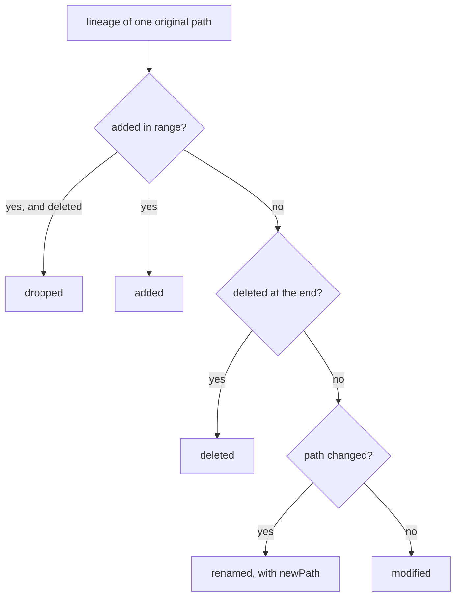

Lessons describe code at one moment. To tell which lessons may now be wrong, TeachMe needs
to know which files changed since that moment, including files that were renamed or deleted,
without the author having to remember anything but a commit sha.

## Four helpers

`server/git.js` runs git with `execFileSync("git", args, { cwd: … })`, never through a shell
string, so paths cannot be interpreted as shell syntax.

- `isGitRepo(dir)`: `git rev-parse --is-inside-work-tree`, false on any failure.
- `hasCommits(dir)`: `git rev-parse --verify --quiet HEAD`, false in a repo with no commits.
- `headCommit(repoRoot)`: `git rev-parse --short HEAD`.
- `changesSince(repoRoot, commit)`: the file changes after `commit` up to HEAD.

## changesSince

It first checks the commit exists with `git rev-parse --verify --quiet <commit>^{commit}`
and throws `UnknownCommitError` if not. Then it asks for the log with rename detection:

```js
[
  "-c",
  "core.quotePath=false",
  "log",
  "-M",
  "--name-status",
  "--format=%x00%h%x09%s",
  "--no-show-signature",
  `${commit}..HEAD`,
],
```

Each commit starts with a NUL byte, then short sha, tab, subject; `parseCommitBlock()` reads
the name-status lines below it (`A`, `D`, `M`, `R`; copies and type changes count as
modifies).

## Following a file through renames

`aggregateChanges()` walks the commits oldest first and keeps one lineage per original path,
indexed by where the file is now. A rename moves the lineage to the new path instead of
starting a new one, so `a.js → b.js → c.js` stays one entry. At the end each lineage becomes
a `FileChange` from `shared/types.d.ts`:



A file that was deleted and re-added at the same path in the range continues its lineage,
so it nets out to a single `modified` entry. Every `FileChange` keeps the commits that
touched it, newest first, as `{ sha, subject }`.

## Key takeaways

- git is called with argument arrays, never a shell string.
- An unknown `syncedCommit` raises `UnknownCommitError` instead of an empty result.
- Renames are followed, so a moved file is reported as `renamed` with its `newPath`.
