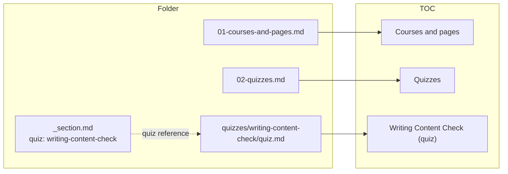

Quizzes live under `.teachme/quizzes/<quiz-slug>/`, independent of any
course. A `quiz.md` needs a `title`; `passingScore` defaults to 70
(percent). Each question is its own file, numbered like pages.

A quiz can be taken standalone, or attached to a course: a section's
`_section.md` can point at one with `quiz: <slug>`, and so can a course's
`course.md`. Either way, the quiz shows up as the last item of that
section's or course's table of contents. This diagram shows how the
`writing-content-check` quiz you're about to take fits into this section's
folder and TOC:

The shapes sent to the browser are typed once, in `shared/types.d.ts`, and
imported by both the server and the React app — a `TocItem` is exactly
`{ type, path, title, section, quizSlug? }`.
