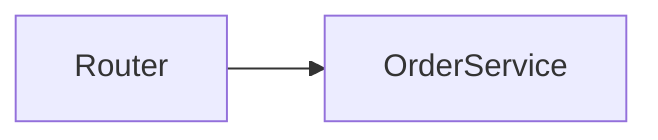

# TeachMe content format

The complete format of a `.teachme/` folder. `teachme validate` enforces everything
marked as an error below. A working example lives in `../examples/.teachme/`.

## 1. Folder layout

```
.teachme/
  courses/
    <course-slug>/
      course.md                 # required
      01-<page>.md
      02-<section>/             # optional: ONE level of sections
        _section.md             # optional
        01-<page>.md
      03-<page>.md
  quizzes/
    <quiz-slug>/
      quiz.md                   # required
      01-<question>.md          # one question per file
```

- All frontmatter is YAML between `---` lines at the very top of the file.
- A course folder holds pages (`.md` files) and section folders. A section folder holds
  pages only: folders inside a section are ignored.
- A quiz folder holds question files only: folders inside it are ignored.
- Ignored for structure: `.md` files starting with `_` (except `_section.md`) and all
  non-`.md` files. They can still be linked, e.g. images next to a page:
  ``.

### Ordering

- Entries with a numeric `NN-` prefix come first, by numeric value, then by full name.
- Entries without a prefix come after, alphabetically.
- Use two-digit prefixes (`01-`, `02-`, …) on every page, section and question file.
- Home screen: courses sort by `order` (courses without `order` last), then by `title`.
  Quizzes sort by `title`.

### Slugs

| Thing | Slug | Example |
|---|---|---|
| Course | folder name, unchanged | `courses/architecture/` → `architecture` |
| Quiz | folder name, unchanged | `quizzes/arch-final/` → `arch-final` |
| Section | folder name without `NN-` | `02-writing-content/` → `writing-content` |
| Page | filename without `NN-` and `.md` | `02-first-request.md` → `first-request` |
| Page in a section | `<section-slug>/<page-slug>` | `writing-content/first-request` |
| Question | filename without `NN-` and `.md` | `01-page-slug.md` → `page-slug` |

- Course and quiz folders keep their full name as the slug: do not give them a `NN-` prefix.
- Use lowercase kebab-case for every slug.
- Slugs must be unique within their scope: top-level pages and sections of one course
  share a scope, pages of one section share a scope, questions of one quiz share a scope.
  `01-intro.md` and `02-intro.md` in the same scope is a `Duplicate slug` error.

## 2. `course.md`

```yaml
---
title: Architecture overview      # REQUIRED, must be a string
description: How requests flow…   # optional, shown on the home card
duration: 25 min                  # optional, free text
order: 1                          # optional number, home-screen sort
quiz: architecture-final          # optional, slug of the final course quiz
syncedCommit: "3f2a9c1"           # optional, commit the content was last synced to
---
Markdown body shown on the course landing page.
```

- A course needs at least one page (`Course has no pages`).
- `quiz:` must name an existing quiz folder under `quizzes/`.

## 3. `_section.md`

```yaml
---
title: Getting started            # optional, overrides the humanized folder name
quiz: getting-started-check       # optional, quiz shown at the end of this section
---
```

- The body is ignored.
- Without `_section.md` (or without `title`), the section title is the folder name without
  prefix, hyphens replaced by spaces, first letter capitalized:
  `02-getting-started/` → `Getting started`.

## 4. Page file

````md
---
title: First request              # optional
sources:                          # optional, repo-relative paths this page explains
  - src/server/router.ts
  - src/orders/service.ts
---
GitHub-flavored Markdown.


````

- Title: frontmatter `title`; else the first line of the body if it is a `# H1` (that
  heading is then removed from the body so it is not shown twice); else the humanized
  filename slug.
- Body: GitHub-flavored Markdown. ```` ```mermaid ```` blocks render as diagrams; see
  `mermaid.md`.

### Linking between lessons

Write a normal relative Markdown link to the lesson's `.md` file, resolved from the folder of
the file containing the link (like images). The app turns it into a link to that lesson:

- Same folder: `[Frontmatter](02-frontmatter.md)`
- Another section: `[Frontmatter](../02-content-format/02-frontmatter.md)`
- Top-level page from a section: `[Intro](../01-intro.md)`
- Another course: `[Setup](../../other-course/01-setup.md)`
- Anchor: `[Sources](02-frontmatter.md#sources)`

Keep the `NN-` prefixes and `.md`: link to the real file name, not the URL slug. Links to
other `.md` files (`course.md`, `_section.md`, anything outside `courses/`) are left as-is.

## 5. `quiz.md`

```yaml
---
title: Architecture basics        # REQUIRED, must be a string
description: Check your…          # optional
passingScore: 70                  # optional number 0–100 (percent), default 70
course: architecture-overview     # optional, slug of the related course
syncedCommit: "3f2a9c1"           # optional
---
Markdown intro shown on the quiz start screen.
```

- A quiz needs at least one valid question (`Quiz has no questions`).
- `course:` must name an existing course folder. It links the quiz's standalone results
  page to that course; it does not place the quiz inside the course (use `quiz:` for that).

## 6. `sources:` and `syncedCommit`

These two fields drive `teachme status` (staleness detection from git history).

- `sources:` is allowed on pages and questions. It is a YAML list of paths relative to the
  **repo root** (`git rev-parse --show-toplevel` from the content dir; outside git, the
  content dir's parent), never relative to the Markdown file. Block form
  (`- path` lines) and flow form (`[a.ts, b.ts]`) both work. List files, not directories.
- A page or question becomes **stale** when a file in its `sources:` is modified or renamed
  after the parent course's/quiz's `syncedCommit`. Content without `sources:` is never
  reported stale, so list every file the text makes claims about.
- `syncedCommit` is allowed on `course.md` and `quiz.md` only. Set it to the output of
  `git rev-parse --short HEAD` at the moment the content matches the code.
- **Always quote `syncedCommit`.** YAML reads unquoted hex like `1234567`, `0123456` or
  `12e4567` as a number (`12e4567` becomes `Infinity`); validation reports
  `syncedCommit must be a quoted string` and the item is treated as never synced.
- Pages and questions inherit the `syncedCommit` of their course or quiz. A section quiz
  has its own `syncedCommit` in its own `quiz.md`.

## 7. Question file

````md
---
title: Payment failure handling   # optional, label in the results list
sources: [src/orders/service.ts]  # optional
---
What does `OrderService` do when a payment fails?

```ts
await this.payments.charge(order);
```

## Options
- [ ] Retries the charge until it succeeds
- [x] Marks the order `PAYMENT_FAILED` and emits `order.failed`
- [ ] Deletes the order

## Explanation
Shown after answering. See `src/orders/service.ts` → `handlePaymentError()`.
````

A multi-select question (more than one `[x]`):

````md
---
title: Where a quiz can be attached
---
Where can a `quiz:` reference attach an existing quiz to a course? (Select all that apply.)

## Options
- [x] A section's `_section.md`
- [x] A course's `course.md`
- [ ] A question file

## Explanation
Both `_section.md` and `course.md` accept `quiz:`; see `loadCourseToc` in
`server/content.js`.
````

Frontmatter is optional on questions; a file can start directly with the prompt.

### Question rules

- **Prompt** = everything before the `## Options` heading. It may contain Markdown, code
  fences and mermaid blocks. `## ` headings inside code fences are ignored by the parser.
- **Options** = the lines between `## Options` and the next `## ` heading (or end of file).
  - Each option is exactly one line: `- [ ] text` (wrong) or `- [x] text` / `- [X] text`
    (correct). The text is inline Markdown (code spans, bold, links).
  - Blank lines are allowed. Any other line (continuation text, nested bullets, `* [ ]`,
    `###` headings, code fences) is an error: `Unexpected line in Options: "<line>"`.
  - At least 2 options and at least 1 correct option.
- **Single vs. multi**: exactly one `[x]` renders radio buttons; more than one renders
  checkboxes, and the answer counts only if the selected set equals the correct set.
- **Explanation** = the body of `## Explanation`, up to the next `## ` heading. Optional;
  shown after the learner checks the answer. Put code excerpts here, not in options.
- Heading names are matched case-insensitively (`## options` works); use `## Options` and
  `## Explanation`.
- Question title: frontmatter `title`, else the humanized filename slug.
- A question with any error is dropped from its quiz.

## 8. Quizzes inside courses

- `_section.md` with `quiz: <slug>` → the quiz is the last TOC item of that section.
- `course.md` with `quiz: <slug>` → the quiz is the last TOC item of the course
  ("Final quiz").
- A quiz is defined once under `quizzes/` and can be referenced from any number of
  sections and courses; it can also be taken standalone from the home screen.
- Convention: name section quizzes `<section-or-topic>-check` and final quizzes
  `<course-slug>-final`, and set `course: <course-slug>` in their `quiz.md`.

## 9. Validation (`teachme validate [dir]`)

Output is one line per issue, then a summary:

```
ERROR courses/arch/course.md: Unknown quiz "arch-final"
WARN courses/arch/01-intro.md: Source not found: src/old/router.ts
1 errors, 1 warnings
```

`<file>` is relative to the content dir. Exit code is 1 if there is any error, else 0.
A missing content dir prints `No TeachMe content at <abs-path>. Create it with the
teachme-authoring skill.` and exits 1.

### Errors (exit 1; the broken item is left out of the app)

| Message | Cause and fix |
|---|---|
| `Invalid frontmatter: <yaml error>` | YAML does not parse. Quote values containing `: `, `#`, or starting with `` ` ``, `*`, `[`, `{`, `@`. |
| `Missing course.md` | A folder under `courses/` has no `course.md`. |
| `Missing quiz.md` | A folder under `quizzes/` has no `quiz.md`. |
| `Missing required "title"` | `course.md`/`quiz.md` has no `title`, or it is not a string (`title: 2024` is a number: quote it). |
| `Course has no pages` | No valid page files in the course. |
| `Quiz has no questions` | No valid question files in the quiz (also happens when every question has errors). |
| `Missing "## Options" section` | Question file has no `## Options` heading. |
| `Needs at least 2 options` | Fewer than 2 `- [ ]`/`- [x]` lines under `## Options`. |
| `No correct option marked` | No `[x]` option. |
| `Unexpected line in Options: "<line>"` | A non-option, non-blank line under `## Options`. |
| `Unknown quiz "<slug>"` | `quiz:` in `course.md` or `_section.md` names no loaded quiz. |
| `Unknown course "<slug>"` | `course:` in `quiz.md` names no loaded course. |
| `Duplicate slug "<slug>"` | Two entries in one scope resolve to the same slug. |
| `passingScore must be a number between 0 and 100` | `passingScore` is not a number in 0–100 (`"70"` and `70%` are invalid). |
| `syncedCommit must be a quoted string` | `syncedCommit` in `course.md`/`quiz.md` is not a string: unquoted hex like `1234567` or `12e4567` is read as a number. Write `syncedCommit: "1234567"`. The item is kept and treated as never synced. |
| `sources must be a list of file paths` | `sources:` is not a list of strings (e.g. a mapping, a number, or a list containing a number). The item is kept with only its string entries. A single string is accepted as a one-item list. |

Errors cascade: a quiz dropped for its own error makes every `quiz:` reference to it an
`Unknown quiz` error. Fix the first error in a chain, then re-run.

### Warnings (exit 0)

| Message | Cause and fix |
|---|---|
| `Source not found: <path>` | A `sources:` entry does not exist under the repo root. Fix the path (it is repo-relative). |
| `Empty mermaid block` | A ```` ```mermaid ```` fence with no content. |
| `Image not found: <src>` | A relative image link does not resolve from the Markdown file's folder. |

Treat warnings as defects: finished content has 0 errors and 0 warnings. Mermaid syntax
is not checked by `validate`; see `mermaid.md`.
