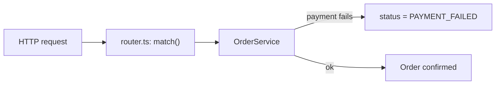
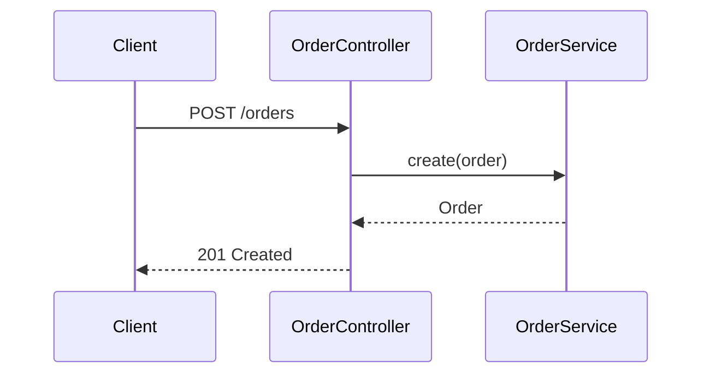
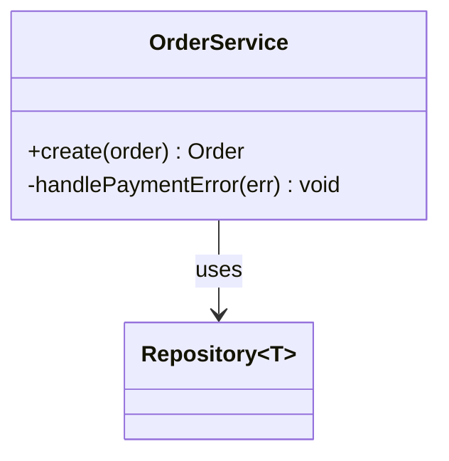
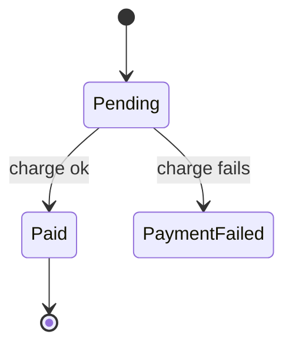
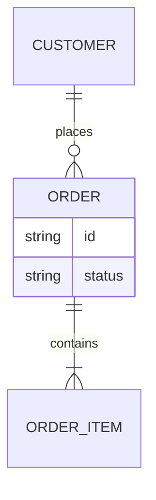

# Mermaid in TeachMe

Pages, course/quiz intros and question prompts render ```` ```mermaid ```` fences as
diagrams (Mermaid 12, `securityLevel: "strict"`). `teachme validate` only warns on an
**empty** block; it cannot parse Mermaid. A syntax error shows up only in the UI, as an
inline error box in place of the diagram. Check every diagram against this file.

## When to draw

- Draw when the lesson explains a flow, a sequence of calls, a set of relationships or a
  lifecycle. Do not draw lists, single calls or folder trees (use a code block).
- One diagram per concept. At most 15 nodes; split larger diagrams.
- Label nodes with real names from the code (`OrderService`, `handlePaymentError()`,
  `orders` table), matching the file paths in `sources:`.
- Put a sentence before each diagram saying what it shows.

## Preferred types

| Concept | Type |
|---|---|
| Request/data flow, pipeline, decision | `flowchart` |
| Calls between components over time | `sequenceDiagram` |
| Types, classes, interfaces and their links | `classDiagram` |
| Lifecycle / status transitions | `stateDiagram-v2` |
| Database tables and relations | `erDiagram` |

Use only these five. Write `flowchart`, never the older `graph` keyword.

### Avoid subgraphs and HTML labels

TeachMe renders every diagram with `htmlLabels: false`, so labels are drawn as plain SVG
`<text>`, not as HTML inside `<foreignObject>` (Mermaid's default). Write labels for
that renderer:

- **No `subgraph`.** No diagram in TeachMe's own content uses one, so they are untested
  in this renderer. The one subgraph diagram that shipped showed up for one user as grey
  container boxes holding tiny, unlabeled nodes. Show grouping with node labels instead
  (`toc1["TOC: Quizzes"]`), or split the diagram in two.
- **No HTML in labels** (`<br/>`, `<b>`, `<i>` …). With SVG-text labels, formatting
  tags like `<b>` and `<i>` are not applied: they appear literally, angle brackets and
  all. `<br/>` does still break the line, but the line breaks it makes are hard-coded,
  and they stack on top of Mermaid's own wrapping.
- **Keep labels short.** SVG-text labels wrap at about 200px, and a long unbroken token
  such as a file path is split mid-word (`01-courses-an` / `d-pages.md`). Move detail
  into an edge label (`A -->|"quiz: slug"| B`) or into the prose around the diagram.

### flowchart



Always write the direction: `flowchart LR` (left→right) or `flowchart TD` (top→down).

### sequenceDiagram



`->>` is a call, `-->>` is a reply. Message text runs from the `:` to the end of the line.

### classDiagram



Generics use `~T~`, not `<T>`.

### stateDiagram-v2



### erDiagram



Every relationship needs a `: label`. Attributes are `type name`.

## Rules that prevent parse errors

1. **Quote labels containing any of `( ) [ ] { } : ; ,`** (and `<`, `>`, `|`, `#`):
   `A["parse(body)"]`, `B["status: open"]`. Unquoted, brackets are read as node-shape
   syntax and fail to parse; quoting every label with punctuation is the safe habit.
2. **Never use `end` as a bare node id.** Lowercase `end` is a reserved keyword and
   breaks the parse. Use `done`, `finish` or `End`.
3. Node ids are single words (`orderSvc`, `step_2`); put the display text in the label.
4. In flowcharts, a node id starting with `o` or `x` right after `--` becomes an edge
   shape (`A--oB`). Put a space around the arrow: `A --> oB`.
5. Inside a quoted label, write a double quote as `#quot;`. Don't force line
   breaks with `<br/>`. It works, but Mermaid already wraps labels at about 200px, and
   the two stack up. Shorten the label instead (see "Avoid subgraphs and HTML labels").
6. In `sequenceDiagram` message text, a `;` ends the statement: write `#59;` instead.
7. The fence info string is exactly `mermaid` (lowercase), and the block is not empty.
8. No `click` directives or scripts: `securityLevel: "strict"` blocks them.

## Common parse errors and fixes

| Symptom in the UI error box | Cause | Fix |
|---|---|---|
| `Parse error … got 'PS'` | `(` or `)` in an unquoted label: `A[run()]` | Quote the label: `A["run()"]` |
| `Parse error … got 'SQS'` | `[` or `]` in an unquoted label: `A[list[0]]` | `A["list[0]"]` |
| `Parse error … got 'DIAMOND_START'` | `{` or `}` in an unquoted label | `A["opts {a}"]` |
| `Parse error … got 'end'` | Node id `end` | Rename the node: `done[End]` |
| Circle or cross edge instead of an arrow | Node id starts with `o`/`x` right after `--` | Add spaces: `A --> oNode` |
| `No diagram type detected …` | Missing or misspelled first line (`flowchat LR`) | Start with one of the five type keywords |
| `Parse error … got 'DEPENDENCY'` in `classDiagram` | `<T>` generics | Use `~T~` |
| `Parse error … Expecting 'COLON'` in `erDiagram` | Relationship without `: label` | Add `: label` |
| Sequence `Parse error` after a `;` | `;` in message text | Write `#59;` |
| Source shows as a plain code block, no diagram | Fence written as ```` ```Mermaid ```` or ```` ``` mermaid-js ```` | Use exactly ```` ```mermaid ```` |
